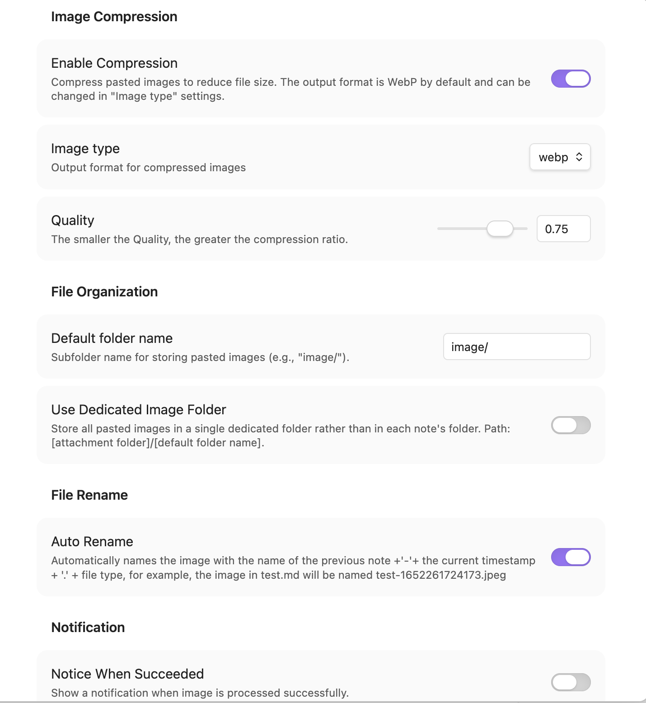

# obsidian-paste-image-handler

Forked from [obsidian-paste-png-to-jpeg](https://github.com/musug/obsidian-paste-png-to-jpeg), with added WebP support and refactored settings.

By default, Obsidian saves pasted images in their original format (PNG, JPG, etc.) with generated filenames like "Pasted image 20240225123456.png". This plugin allows you to customize how images are handled when pasted into your notes.

## Features

- **Image Compression**: Automatically compress pasted images and convert them to WebP or JPEG format (WebP by default). Adjustable compression quality
- **Smart Naming**: Rename images based on the current note name + timestamp (e.g., pasting into `hello.md` generates `hello-1708834567890.webp`)
- **Organized Storage**: Save images to an `image/` folder within the current note's directory, or configure a dedicated folder for all pasted images

## Installation

### From Obsidian Community Plugins

1. Open Obsidian Settings → Community Plugins
2. Disable Safe Mode if prompted
3. Search for "Paste Image Handler"
4. Click Install and Enable

### Manual Installation

1. Download the latest release from [GitHub Releases](https://github.com/cyio/obsidian-paste-image-handler/releases)
2. Extract the zip file to your Obsidian plugins folder: `<vault>/.obsidian/plugins/`
3. Enable the plugin in Obsidian Settings → Community Plugins

## Usage

When you paste an image into a note, the plugin automatically:

1. Converts the image to your selected format (WebP by default)
2. Compresses the image based on your quality settings
3. Saves it to an `image/` folder in the current note's directory
4. Renames it using the note name + timestamp

**Example**: A screenshot pasted into `hello.md` will be saved as `hello-1708834567890.webp`

## License

MIT

## Acknowledgments

- Original plugin by [musug](https://github.com/musug/obsidian-paste-png-to-jpeg)